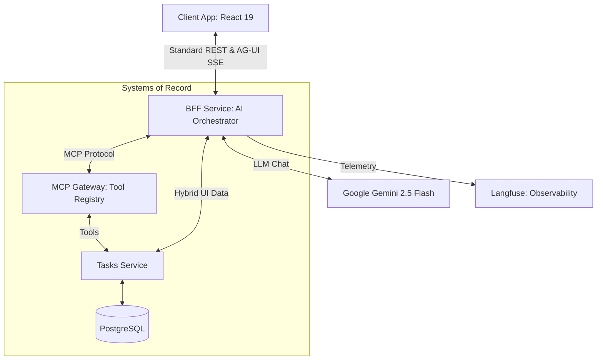

# 🧘 ZenDo — Enterprise AI-First App Platform

ZenDo is a state-of-the-art reference architecture for building **Enterprise Suites** that are AI-native from the ground up. It demonstrates how to build a production-ready, multi-service application where AI agents and traditional UIs coexist seamlessly using the **Model Context Protocol (MCP)** and **Agentic UI (AG-UI)** standards.

---

## 🏗 High-Level Architecture

ZenDo is designed around the principle of **Decoupled Intelligence**. The AI logic (BFF) is separated from the Domain logic (Systems of Record) by an MCP Gateway, allowing the platform to scale to dozens of services without AI bloat.



### 🛰 The Services

| Service | Role | Technology |
|---|---|---|
| **`client-app/`** | Hybrid UI | React 19, Vite, Tailwind CSS 4, Framer Motion |
| **`bff-service/`** | AI Orchestrator | Node.js, Express, MCP Client, SSE Streaming |
| **`mcp-service/`** | Tool Gateway | MCP SDK, Express (SSE Transport) |
| **`tasks-service/`** | System of Record | Node.js, PostgreSQL 15 |
| **`shared/`** | Contract Layer | Zod Schemas, TypeScript Workspaces |

---

## 🧠 AI Strategy: The Hybrid Approach

ZenDo implements a **Progressive Enhancement** model for AI:
1.  **Web 3.0 Standard:** Users can use the app like a standard SaaS—clicking buttons, filling forms, and managing tasks manually.
2.  **AI-Native (AG-UI):** A floating glassmorphic assistant can "see" the current state and execute tools on the user's behalf.
3.  **Unified State:** Whether a human clicks "Delete" or the Agent calls `delete_task`, the frontend state remains in sync via **JSON Patch (`StateDelta`)** updates streamed over SSE.

### 🛡 The AG-UI Protocol
ZenDo implements the Agentic UI protocol to ensure transparency and safety:
-   **Reasoning Traces:** Gemini streams its internal logic inside `<thought>` tags, which the UI renders as collapsible "Reasoning" blocks.
-   **Interrupt Safety:** Destructive tools (like clearing all tasks) require a "confirmed" flag, allowing the UI to interrupt the agent and ask for human permission.

---

## 🛠 Enterprise Tools (MCP Registry)

The **`mcp-service`** dynamically exposes these tools to the Agent. New services can be added to the registry without touching the BFF logic.

| Tool Name | Capability |
|---|---|
| `get_tasks` | Fetch tasks with optional completion filtering. |
| `create_task` | Add a new System of Record entry. |
| `update_task` | Modify titles, descriptions, or status. |
| `delete_task` | Remove a specific task by ID. |
| `clearCompletedTasks` | Bulk destructive action (Interrupt-aware). |
| `navigateToView` | Agent can programmatically move the user's UI. |
| `getDailyBriefing` | Multi-step reasoning tool for task summarization. |

---

## 🚀 Deployment & Setup

### Prerequisites
-   **Docker Desktop**
-   **Google Gemini API Key** ([Get it here](https://aistudio.google.com))

### 1. Configuration
Create a `.env` file in the root directory:

```bash
# AI Engine
GEMINI_API_KEY=your_key_here

# Observability (Defaults for local Docker)
LANGFUSE_PUBLIC_KEY=pk-lf-b64212b7-6190-4a6b-908f-7cc9fa2e0883
LANGFUSE_SECRET_KEY=sk-lf-de9ec0b5-0dd1-41dd-802a-5fcffa315e44
```

### 2. Start the Suite
```bash
docker compose up -d --build
```

### 3. Service Map
-   **Frontend:** [http://localhost:4000](http://localhost:4000)
-   **AI BFF:** [http://localhost:4001](http://localhost:4001)
-   **MCP Gateway:** [http://localhost:4003](http://localhost:4003)
-   **Langfuse:** [http://localhost:3000](http://localhost:3000)

---

## 🗺 Roadmap to Enterprise Suite

- [ ] **Multi-Agent Supervisor:** Route requests between specialized Task, CRM, and HR agents.
- [ ] **RBAC for AI:** Connect MCP tool availability to user JWT permissions.
- [ ] **Semantic Memory:** Vectorized task search using `pgvector`.
- [ ] **MCP Resource Templates:** Expose large datasets as MCP Resources rather than raw prompt injections.
- [ ] **Generative UI:** Stream React component definitions from the agent for custom dashboard widgets.
