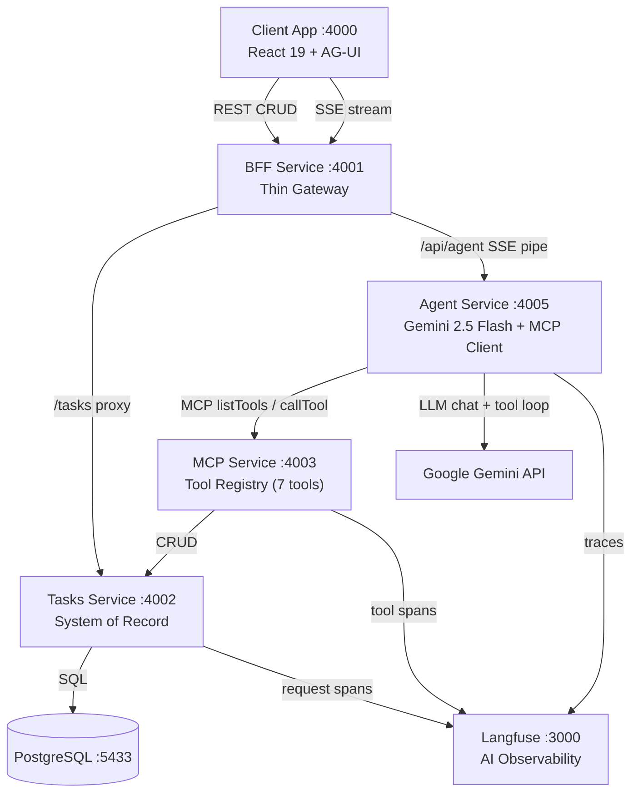

# ZenDo — AI-First Platform

A reference implementation for building AI-native enterprise applications using **Model Context Protocol (MCP)** and **AG-UI** standards. Fully containerized, production-shaped microservices monorepo.

---

## Architecture



### Services

| Service | Port | Role |
|---|---|---|
| `client-app` | 4000 | React 19 + Vite + Tailwind CSS 4 hybrid UI |
| `bff-service` | 4001 | Thin gateway — proxies CRUD and pipes Agent SSE |
| `tasks-service` | 4002 | CRUD system of record — PostgreSQL 15 + SQLite fallback |
| `mcp-service` | 4003 | MCP tool registry — 7 tools over SSE transport |
| `agent-service` | 4005 | AI orchestrator — Gemini 2.5 Flash + MCP client loop |
| `langfuse` | 3000 | Self-hosted AI observability |

---

## How It Works

### Agent Loop

1. User types intent in the chat console
2. Client POSTs `{ intent }` to BFF `/api/agent`
3. BFF pipes the request to Agent Service and streams the SSE response back
4. Agent Service:
   - Connects to MCP Service as an MCP client
   - Calls `listTools()` — dynamically discovers all 7 tools
   - Sends initial task state snapshot to client (`StateSnapshot`)
   - Runs a Gemini 2.5 Flash chat loop with the discovered tools
   - Streams `<thought>` blocks as reasoning events, text as message events
   - On each tool call: executes via MCP, diffs state with JSON Patch, streams `StateDelta`
   - Loops until Gemini stops requesting tool calls
5. Client patches its local state in real time — no full refetch needed

### AG-UI Protocol

Events streamed over SSE follow the AG-UI standard:

| Event | Meaning |
|---|---|
| `RunStarted` | Agent loop begins |
| `StateSnapshot` | Full task list at run start |
| `ReasoningMessageStart/Content/End` | Gemini `<thought>` blocks |
| `TextMessageStart/Content/End` | Final assistant text |
| `ToolCallStart` | Tool invocation begins |
| `ToolCallResult` | Tool returned a result |
| `StateDelta` | JSON Patch to update client state |
| `RunFinished` | Loop complete |
| `RunError` | Unrecoverable error |

### MCP Tools

The `mcp-service` exposes these tools. The agent discovers them dynamically at runtime — no hardcoding in the agent.

| Tool | Description |
|---|---|
| `get_tasks` | List tasks, optionally filtered by completion status |
| `create_task` | Create a new task |
| `update_task` | Update title, description, or completed status |
| `delete_task` | Delete a task by ID |
| `clearCompletedTasks` | Bulk-delete all completed tasks (requires `confirmed: true`) |
| `navigateToView` | Programmatically navigate the client UI |
| `getDailyBriefing` | Summarize current incomplete tasks |

### Observability

- **Agent Service** — full Langfuse trace per agent run, tagged `gemini`, `agent`, `mcp`
- **Tasks Service** — optional per-request trace (activates when `LANGFUSE_PUBLIC_KEY` is set)
- **MCP Service** — per-tool-call span with input args, output, and error level

---

## Setup

### Prerequisites

- Docker Desktop
- Google Gemini API key — [aistudio.google.com](https://aistudio.google.com)
- Langfuse keys (can self-generate after first run — see below)

### 1. Configure environment

Create `.env` in the repo root:

```bash
GEMINI_API_KEY=your_gemini_key_here

LANGFUSE_PUBLIC_KEY=pk-lf-...
LANGFUSE_SECRET_KEY=sk-lf-...
```

To get Langfuse keys: start the stack once, open http://localhost:3000, create an account and project, copy the keys into `.env`, then run `docker compose up -d` again.

### 2. Start everything

```bash
docker compose up -d --build
```

Starts all 8 containers: `tasks-db`, `tasks-service`, `mcp-service`, `agent-service`, `bff-service`, `client`, `langfuse-service`, `langfuse-db`.

### 3. Open

| URL | What |
|---|---|
| http://localhost:4000 | App UI |
| http://localhost:3000 | Langfuse observability |

---

## Stack

**Backend** — Node.js 20, Express, TypeScript, `tsx`

**AI** — Google Gemini 2.5 Flash (`@google/generative-ai`), MCP SDK (`@modelcontextprotocol/sdk`), Langfuse, `fast-json-patch`

**Frontend** — React 19, Vite 6, Tailwind CSS 4, Framer Motion

**Database** — PostgreSQL 15 (Docker), SQLite (local dev fallback)

**Infrastructure** — Docker Compose, Nginx (client), npm workspaces

---

## Development

All development is done via Docker Compose. There is no separate local dev mode — the services run in watch mode inside containers so code changes hot-reload automatically.

```bash
# Rebuild and restart after dependency changes
docker compose up -d --build

# View logs for a specific service
docker compose logs -f agent-service

# Restart a single service after code changes (watch mode handles this automatically)
docker compose restart agent-service
```

---

## Strategy & Roadmap

Detailed technical strategy documents live in [`/zendo`](./zendo/):

| Document | Topic | Status |
|---|---|---|
| [01 — AG-UI Protocol](./zendo/01-ag-ui-protocol.md) | SSE event streaming, JSON Patch, interrupt safety, generative UI | In Progress |
| [02 — Model Context Protocol](./zendo/02-model-context-protocol.md) | MCP server exposure, external tool integration (Claude Desktop, Cursor) | Planned |
| [03 — Multi-Agent Orchestration](./zendo/03-multi-agent-orchestration.md) | Supervisor router, specialized sub-agents, TypeScript state graphs | Planned |
| [04 — LLMOps & Evaluations](./zendo/04-llmops-and-evaluations.md) | Human feedback, LLM-as-a-Judge, prompt A/B testing via Langfuse | Planned |
| [05 — Semantic Memory & RAG](./zendo/05-semantic-memory-rag.md) | `pgvector` embeddings, semantic task search, user preference memory | Planned |
| [06 — Auth & Multi-Tenancy](./zendo/06-auth-and-multitenancy.md) | JWT gateway, user-scoped task storage, RBAC for destructive MCP tools | Planned |
| [07 — LLM Provider Portability](./zendo/07-llm-provider-portability.md) | Adapter pattern for Gemini/Claude/OpenAI, env-driven provider swap | Planned |
| [08 — Reliability & Resilience](./zendo/08-reliability-and-resilience.md) | Retry with backoff, SSE event IDs, idempotent tool calls, circuit breaker | Planned |
| [09 — Audit Trail](./zendo/09-audit-trail.md) | Append-only compliance log, immutability guarantees, retention policy | Planned |
| [10 — Testing Strategy](./zendo/10-testing-strategy.md) | MCP tool unit tests, mock-LLM integration tests, prompt regression suite | Planned |
| [11 — Cost & Quota Management](./zendo/11-cost-and-quota-management.md) | Token budgets, per-user quotas, rate limiting, cost attribution | Planned |
