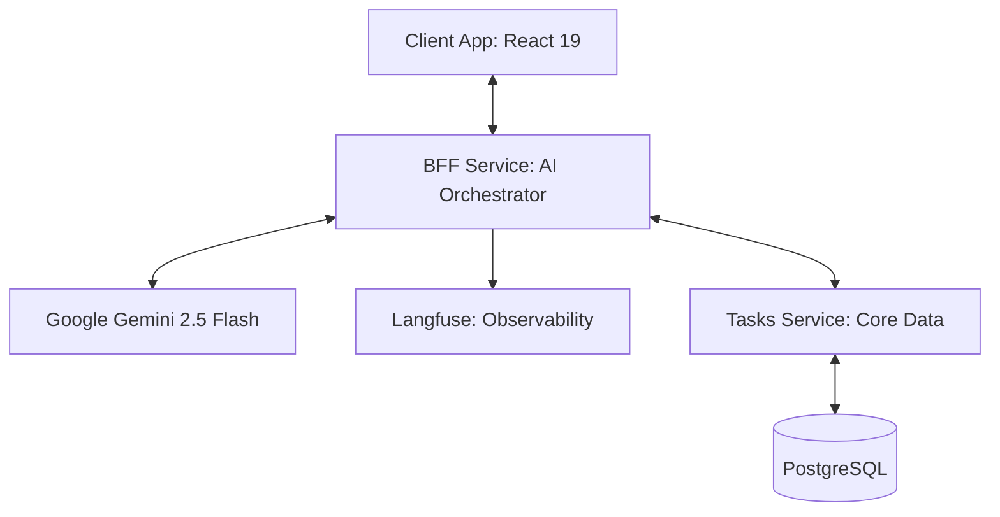

# 🧘 ZenDo — State-of-the-Art AI Reference Architecture

ZenDo is a serene, AI-powered task management workspace built to demonstrate modern AI engineering patterns in production-ready applications. It serves as a reference architecture for implementing **Agentic UI (AG-UI)**, **Autonomous Tool Calling**, and **LLM Observability**.

Featuring a focused, minimalist design and a floating glassmorphic **AI Assistant**, ZenDo allows you to manage your workspace using natural language, backed by real-time streaming reasoning and local AI tracing.

---

## ✨ Key Features

- **AG-UI Protocol Implementation** — Real-time streaming of agent reasoning traces (`<thought>` tags) and internal planning via Server-Sent Events (SSE).
- **Autonomous Agentic Workflows** — Powered by **Gemini 2.5 Flash**, the assistant can create, update, complete, and delete tasks, as well as navigate the UI on your behalf.
- **Interrupt-Aware Safety** — Destructive actions (like deleting tasks) trigger an "Interrupt" state, requiring explicit user confirmation before execution.
- **State Synchronization** — The agent streams JSON Patch deltas (`StateDelta`) to keep the UI perfectly in sync with its internal model of your tasks.
- **AI Observability** — Built-in integration with **Langfuse** for tracing agent turns, token usage, and tool execution history.
- **Modern Microservices** — A clean split between orchestration (BFF), data management (Core Service), and the frontend.

---

## 🏗 Architecture

ZenDo follows a modern microservices pattern optimized for AI orchestration:



- **`client-app/`**: A React 19 + Vite frontend. Uses SSE to listen to the agent and Framer Motion for a fluid, "alive" UI.
- **`bff-service/`**: The "Brain" of the operation. Handles the AG-UI protocol, Gemini integration, and proxies data requests to the core services.
- **`tasks-service/`**: A dedicated data microservice managing the task lifecycle and PostgreSQL persistence.
- **`shared/`**: Common Zod schemas and TypeScript types used across the entire stack for end-to-end type safety.

---

## 🤖 AI Capabilities (The Agent)

The assistant is more than a chatbot; it is a workspace controller. You can use commands like:

| Command | What happens |
|---|---|
| `"Plan my day"` | The agent fetches your tasks and provides a briefing. |
| `"Create a task for my 2pm meeting"` | Calls the `createTask` tool autonomously. |
| `"Clear all my finished work"` | Triggers the `clearCompletedTasks` interrupt for confirmation. |
| `"Show me my completed tasks"` | Uses `navigateToView` to switch the UI context. |

---

## 🚀 Getting Started

### Prerequisites
- **Docker** and **Docker Compose**
- **Google Gemini API Key** (Get one at [aistudio.google.com](https://aistudio.google.com))

### 1. Environment Configuration

Create a `.env` file in the **root** directory:

```bash
# LLM
GEMINI_API_KEY=your_gemini_api_key_here

# Local Langfuse (Defaults for local Docker setup)
LANGFUSE_PUBLIC_KEY=pk-lf-b64212b7-6190-4a6b-908f-7cc9fa2e0883
LANGFUSE_SECRET_KEY=sk-lf-de9ec0b5-0dd1-41dd-802a-5fcffa315e44
```

### 2. Start the Stack

```bash
docker compose up -d --build
```

### 3. Access the Services

- **Frontend**: [http://localhost:4000](http://localhost:4000)
- **BFF API**: [http://localhost:4001](http://localhost:4001)
- **Langfuse Dashboard**: [http://localhost:3000](http://localhost:3000)

---

## 🛠 Tech Stack

| Layer | Technology |
|---|---|
| **Frontend** | React 19, Vite, Tailwind CSS 4, Framer Motion |
| **Orchestration** | Node.js, Express, SSE (Server-Sent Events) |
| **AI Model** | Google Gemini 2.5 Flash (`@google/generative-ai`) |
| **Database** | PostgreSQL 15 |
| **Observability** | Langfuse (Self-hosted via Docker) |
| **Type Safety** | Zod, TypeScript Workspaces |

---

## 🗺 Roadmap

We are evolving ZenDo to showcase the cutting edge of AI Engineering:
1. **Model Context Protocol (MCP)** — Enabling ZenDo to act as both an MCP server and client.
2. **Multi-Agent Router** — Moving from a single agent to a specialized swarm.
3. **Semantic Memory** — Integrating `pgvector` for long-term task RAG.
4. **LLM-as-a-Judge** — Automated evaluations using Langfuse.
